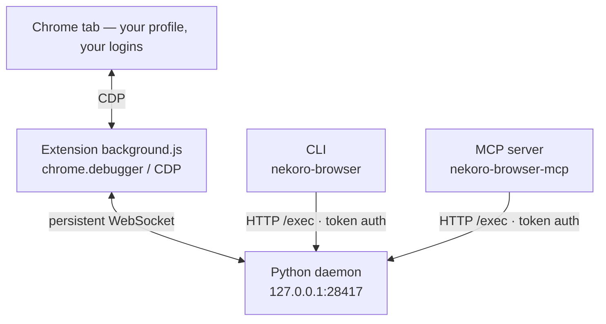

<p align="center">
  
</p>

<p align="center">
  <a href="https://github.com/zeshuochen/nekoro-browser/actions/workflows/tests.yml"></a>
  <a href="https://pypi.org/project/nekoro-browser/"></a>
  <a href="https://www.python.org/downloads/"></a>
  <a href="https://github.com/zeshuochen/nekoro-browser/blob/master/LICENSE"></a>
  <a href="#mcp-any-mcp-client"></a>
</p>

<p align="center">
Let your AI coding tool drive <b>your own Chrome</b> — open pages, click, read them back, still logged in everywhere.<br>
<sub><a href="https://github.com/zeshuochen/nekoro-browser/blob/master/README.zh-CN.md">中文</a></sub>
</p>

<p align="center">
  <a href="#how-it-compares">Compare</a> ·
  <a href="#quick-start">Quick Start</a> ·
  <a href="#examples">Examples</a> ·
  <a href="#mcp-any-mcp-client">MCP</a> ·
  <a href="#api">API</a> ·
  <a href="#architecture">Architecture</a> ·
  <a href="#self-healing-and-site-knowledge">Site Knowledge</a> ·
  <a href="#known-limitations">Limitations</a> ·
  <a href="#reference">Reference</a>
</p>

---

A small extension does the driving, so nothing about your browser changes: same profile,
same logins, no second instance, no "controlled by automated software" banner. Install is
one `uv tool install` — Python stdlib only, no bundled engine, no 200MB download.

Every helper is reflected into an MCP tool (53 of them), so Claude Code, Cursor, Cline,
opencode, Codex and VS Code/Copilot can drive the browser directly. Bring any model — no
subscription, no lock-in. MIT, extension source included.

## How It Compares

| | CDP WebSocket | playwright-cli | opencli | **nekoro-browser** |
|------|:--:|:--:|:--:|:--:|
| Approach | `--remote-debugging-port` | Playwright extension | OpenCLI extension | Custom extension + persistent WebSocket |
| Install | one flag | `npm i -g` (~200MB) | npm / desktop app | `uv tool install` (stdlib only, zero deps) |
| Login state | ❌ fresh instance | ✅ | ✅ | ✅ |
| Modify the extension | — | Edit Playwright source | Edit OpenCLI source | ✅ right in this repo |
| Self-healing | ❌ | ❌ | ❌ | ✅ Agent edits helpers at runtime |
| MCP | ❌ | ✅ (separate `@playwright/mcp`) | ❌ | ✅ built in, 53 tools via `nekoro-browser-mcp` |
| Site knowledge | ❌ | ❌ | ❌ | ✅ your notes and scripts are **handed to the agent on navigate** |

<sub>Why row 3 is ❌: since Chrome 136, <code>--remote-debugging-port</code> refuses the default profile — a raw CDP connection means a fresh instance with none of your logins. An extension's <code>chrome.debugger</code> is exempt.</sub>

## Quick Start

<details>
<summary><b>Rather have your AI do it?</b> Paste this into Claude Code / Cursor / opencode</summary>

```
Install nekoro-browser for me:
1. `uv tool install nekoro-browser` (no uv → `pipx install nekoro-browser`).
2. Run `nekoro-browser setup` and show me the extension path it prints. This step is mine:
   I open chrome://extensions, turn on Developer mode, click Load unpacked, paste that
   path. Wait until I say it's loaded — you cannot click this for me.
3. Then start the daemon in a separate terminal that stays open: `nekoro-browser`.
4. Last step depends on how I'll use it — ask me which:
   - from my AI editor → register the MCP server (`claude mcp add nekoro-browser --
     nekoro-browser-mcp`, or the equivalent config for my client), then I restart it;
   - from the terminal only → nothing to do, `echo "page_info()" | nekoro-browser` works.
5. Finish with `nekoro-browser --doctor` and tell me if daemon / extension / service
   worker are all green.
```

</details>

**1 — Install** (Python 3.12+, zero third-party dependencies)

```bash
uv tool install nekoro-browser
```

No [uv](https://docs.astral.sh/uv/)? `pipx install nekoro-browser` works too.

<sub>From source: <code>git clone https://github.com/zeshuochen/nekoro-browser && cd nekoro-browser && uv pip install -e .</code></sub>

> **Upgrading?** `uv tool upgrade nekoro-browser` only updates the Python side — reload
> the extension afterwards: `nekoro-browser --reload-ext` (or **Reload** on the card in
> `chrome://extensions`).

**2 — Load the extension**

```bash
nekoro-browser setup
```

Copies the extension directory to your clipboard and waits until it connects. Meanwhile:
`chrome://extensions/` → **Developer mode** → **Load unpacked** → paste.

**3 — Start the daemon** — open a **second terminal** and **leave it running** (it's the
background process that holds the Chrome connection; close it and everything stops)

```bash
nekoro-browser
```

**4 — Drive the browser.** Pick the way you actually work:

*From your AI coding tool (MCP)* — one command for Claude Code, other clients in
[MCP](#mcp-any-mcp-client):

```bash
claude mcp add nekoro-browser -- nekoro-browser-mcp
```

Restart the client and ask it to open a page. That's it — 53 browser tools show up.

*From the terminal* — pipe a snippet to the running daemon:

```bash
echo "page_info()" | nekoro-browser
# → {"ok": true, "result": {"title": "...", "url": "..."}}
```

Something down? `nekoro-browser --doctor` checks daemon / extension / service worker
and tells you which one.

---

## Examples

Send a multi-step flow in one shot. Every helper is already `await`-able at top level — no
`asyncio` boilerplate, no imports:

```bash
nekoro-browser <<'PY'
await new_tab("https://example.com")
print((await page_info())["title"])            # Example Domain
print((await get_markdown(max_chars=200))["result"])
print((await state(max_items=3))["result"])    # indexed interactive elements, model-ready
await close_tab()
PY
```

<details>
<summary>On Windows? <code>&lt;&lt;'PY'</code> is bash-only — PowerShell equivalent</summary>

```powershell
@'
await new_tab("https://example.com")
print((await page_info())["title"])
'@ | nekoro-browser
```

The closing `'@` must sit at the start of its own line. One-liners:
`nekoro-browser -c "await navigate('https://example.com')"`.

Not `cmd.exe` — its `echo` keeps the quotes, so the snippet arrives as a string and comes back
`{"ok": true, "result": "page_info()"}` with the browser untouched.

</details>

`state()` numbers the elements and `click_index(n)` clicks by number — the model never has to guess a CSS selector:

```bash
nekoro-browser <<'PY'
await navigate("https://github.com/search?q=browser+automation&type=repositories")
await wait_for_load()
print((await state(max_items=40))["result"])
await click_index(12)
PY
```

All helpers are documented in [SKILL.md](https://github.com/zeshuochen/nekoro-browser/blob/master/SKILL.md).

---

## MCP (any MCP client)

MCP is how Claude Code, Cursor and friends call outside tools. Every function in `helpers.py`
is reflected into one (53 today) — no glue code, so the model gets `navigate`, `click_index`,
`get_markdown`… as first-class tools.

**Prerequisite:** the daemon is running (`nekoro-browser`, its own terminal) — the MCP server
is a thin forwarder, the daemon owns the Chrome connection.

The command to register is always `nekoro-browser-mcp`. Only the config shape differs:

**Claude Code**

```bash
claude mcp add nekoro-browser -- nekoro-browser-mcp
```

**Claude Desktop** (Settings → Developer → Edit Config) · **Cursor** (`~/.cursor/mcp.json`,
or `.cursor/mcp.json` for one project) · **Cline** (MCP Servers → Configure MCP Servers)

```json
{ "mcpServers": { "nekoro-browser": { "command": "nekoro-browser-mcp" } } }
```

<sub>Claude Desktop config file: macOS <code>~/Library/Application Support/Claude/claude_desktop_config.json</code> · Windows <code>%APPDATA%\Claude\claude_desktop_config.json</code></sub>

**opencode** (`opencode.json`) — note `command` is an array, and the key is `mcp`

```json
{ "mcp": { "nekoro-browser": { "type": "local", "command": ["nekoro-browser-mcp"], "enabled": true } } }
```

**Codex** (`~/.codex/config.toml`, or `codex mcp add nekoro-browser -- nekoro-browser-mcp`)

```toml
[mcp_servers.nekoro-browser]
command = "nekoro-browser-mcp"
```

**VS Code / Copilot** (`.vscode/mcp.json`, or `MCP: Open User Configuration`) — the key is
`servers`, not `mcpServers`

```json
{ "servers": { "nekoro-browser": { "command": "nekoro-browser-mcp" } } }
```

Prefer not to install anything up front? Replace the command with `uvx`, which fetches and
runs on demand the way `npx -y` does — e.g. `"command": "uvx", "args": ["--from",
"nekoro-browser", "nekoro-browser-mcp"]`. That only removes the install step for the MCP
server; the daemon still has to be installed and running.

Restart the client afterwards. If the tools don't show up, run `nekoro-browser --doctor`
first — a dead daemon looks exactly like a broken MCP config — then check the client's MCP
log (Claude Desktop keeps them in `~/Library/Logs/Claude` on macOS, `%APPDATA%\Claude\logs`
on Windows).

Beyond the tool list:

- `cdp` — raw CDP command, and `exec_python` — arbitrary Python in the daemon namespace, so
  a whole multi-step flow costs one round trip.
- Screenshots return as image content; clients render them inline.
- A helper failure (`{"ok": false}`) surfaces as `isError`, never dressed up as success.
- Navigating to a site you have notes or scripts for ships them in the tool result — see
  [Site Knowledge](#self-healing-and-site-knowledge).

## API

| Category | Commands |
|----------|----------|
| Navigation | `navigate(url)`, `new_tab(url)`, `ensure_tab(url)`, `new_tab(url, reuse=True)`, `list_tabs()`, `switch_tab(id)`, `close_tab(id)`, `close_tabs(ids)`, `sweep_tabs()` |
| Page info | `page_info()`, `page_html()`, `page_text()`, `get_markdown()`, `state()`, `refs()`, `find_text(t)`, `iframe_target(url_substr)` |
| JavaScript | `js(code)`, `cdp(method, **p)`, `cdp_batch(*cmds)` |
| Interaction | `click(loc)`, `click(loc, tab=id)`, `click_selector(sel)`, `click_ref(ref)`, `click_index(n)`, `click_at_xy(x,y)`, `type_text(t)`, `fill_input(sel,t)`, `press_key(k)`, `upload_file(sel,path)` |
| Dialogs | `dialog_off()`, `get_last_dialog()` |
| Waiting | `wait_for_load()`, `wait_selector(sel)`, `wait_for_network_idle()`, `sleep(s)` |
| Downloads | `wait_for_download()` |
| Screenshots | `capture_screenshot()`, `capture_screenshot("jpeg", 90)` |

---

## Architecture



<details>
<summary>Same diagram as plain text (for renderers without Mermaid, e.g. PyPI)</summary>

```
Chrome extension (background.js) —— chrome.debugger / CDP
        ↕ persistent WebSocket
Python daemon (127.0.0.1:28417)
        ↕ HTTP /exec (token auth)
CLI (nekoro-browser)  ·  MCP server (nekoro-browser-mcp)
```

</details>

- `helpers.py` — 54 thin wrappers over CDP, none aware of any particular website.
- `lifecycle.py` — pid file + process fingerprint (never kills a reused pid), stale-daemon
  self-heal (CDP probe fails → cleanup and restart), localhost bypasses the system proxy.
- Extension, against MV3 service worker eviction — `content_scripts` heartbeat (wake vector
  living in the page, revives a killed SW) + `onStartup` (reconnects on Chrome cold start) +
  reattaches the last-driven tab instead of drifting to a blank one.

## Self-Healing and Site Knowledge

When an agent hits a gap it writes the missing piece and uses it immediately — nothing is
recompiled, no daemon restart, no extension reload.

- `src/nekoro_browser/agent_helpers.py` is **scratch paper**: reloaded on every `/exec`, good
  for a quick experiment. It lives inside the installed package, so an upgrade overwrites it.
- Anything worth keeping goes in your own skills directory (`NEKORO_DOMAIN_SKILLS`, falling
  back to `domain-skills/` in the repo), one folder per site holding both kinds of material:
  `<site>/*.md` for knowledge and `<site>/*.py` for workflows. Scripts are loaded into the
  `/exec` namespace on every call and can use the built-in helpers directly.

The point is that this material **finds the agent instead of waiting to be discovered**.
`navigate()` and `new_tab()` return two extra fields when the site has any:

```python
{'ok': True, 'loaded': True,
 'notes':   ['example/search.md — Example — search results'],
 'actions': ['open_first_result(query) — search and open the top hit']}
```

`notes` lists titles only; `actions` lists functions that are already callable, so the agent
runs one instead of rebuilding the flow. `list_site_actions()` shows everything loaded,
failed files included. What to record — and what not to — is in
[`domain-skills/README.md`](https://github.com/zeshuochen/nekoro-browser/blob/master/domain-skills/README.md).

Tabs work the same way: a tab left over from last time still holds its login and page state,
so `new_tab()` adds an `existing` field when the managed group already has tabs for that site:

```python
{'ok': True, 'tabId': 42, 'loaded': True,
 'existing': {'hint': 'switch_tab(id) reuses an open tab, or new_tab(url, reuse=True)',
              'tabs': [{'tabId': 17, 'title': 'Example Domain'}]}}
```

The tab still opens — the field only makes reuse visible at the moment a duplicate is about
to appear; `reuse=True` navigates the existing one instead. **Nothing is ever closed
automatically**: `sweep_tabs()` only *reports* candidates (same-site duplicates, stray
`about:blank`), `sweep_tabs(dry_run=False)` / `close_tabs([...])` act on them, and the active
tab is never a candidate.

---

## Platform Support

| Platform | Status |
|----------|--------|
| Windows | Primary development platform, exercised end to end |
| Linux / macOS | The code has the branches (`~/.config` and `~/Library/Application Support` data dirs, `chmod 600` token, `/proc` and `ps` liveness probes) and CI runs the unit tests on all three, **but the full "Chrome + extension" loop has never been run on a real macOS/Linux box** — reports welcome |

## Known Limitations

- **Unpacked extensions get disabled by Chrome.** An extension installed via "Load unpacked" may be switched off automatically after a Chrome update or restart, or hidden behind the "Disable developer mode extensions" prompt. When `--doctor` reports Extension/SW not responding, re-enable it in `chrome://extensions/` first. This project is **not published to the Chrome Web Store**, so the limitation is not going away soon.
- **Service worker keepalive is not 100%.** MV3 eviction timing is Chrome's call. The heartbeat + `onStartup` + reattach cover the vast majority of cases, but unattended long-running cron jobs should still health-check with `--doctor` and retry.
- **Everything is anchored to one active tab.** 16 helpers (`click`, `click_selector`, `state`, `wait_selector`, `fill_input`, …) take an explicit `tab=id` to target another **already attached** tab — naming a tab that is not attached is an error, never a silent fallback to the active one. The other 37 always follow the active tab, and there are still no parallel sessions: one daemon drives one Chrome, requests are serialised.
- **Downloads land wherever Chrome is configured to put them; the path cannot be changed from here.** `wait_for_download()` returns `{url, filename, bytes}` — a filename, not a full path. Set the directory in Chrome's own settings. <sub>Both `Browser.setDownloadBehavior` (`-32601`) and the deprecated `Page.setDownloadBehavior` (`-32000 "Cannot not access browser-level commands"`) are browser-level and get rejected under `chrome.debugger`, which only ever hands out a tab target.</sub>
- **The MCP server handles requests serially.** During a `wait_selector(timeout=90)` every other request on that connection (including `ping`) queues behind it. Open separate client connections if you need concurrency.

---

## Reference

<details>
<summary><b>CLI flags, configuration, troubleshooting, security</b> — click to expand</summary>

### CLI

| Command | What it does |
|---------|---------------|
| `nekoro-browser` | Start the daemon (foreground) |
| `nekoro-browser setup` | Guided install: copies the extension path, then waits until the extension actually connects |
| `nekoro-browser --doctor` | End-to-end diagnostic (daemon + extension + SW all alive?) |
| `nekoro-browser --stop` | Stop the daemon |
| `nekoro-browser --restart` | Stop and restart (foreground) |
| `nekoro-browser --reload-ext` | Reload the extension's service worker — **required after upgrading**, also useful before a batch job for a clean state |
| `nekoro-browser --extension-path` | Print the extension directory (for "Load unpacked") |
| `nekoro-browser --version` | Print the installed version (check it against the extension you loaded) |
| `nekoro-browser --port N` | Run the daemon on port N (default 28417) |
| `nekoro-browser -c "code"` | Run one snippet, print the result |
| `nekoro-browser --timeout N` | Seconds to allow a snippet (default 120 — page loads are slow) |
| `echo "code" \| nekoro-browser` | Pipe mode (daemon must already be running) |

### Configuration

The daemon listens on **28417** by default. To change it:

| Side | How |
|------|-----|
| Python (daemon + CLI + MCP) | `nekoro-browser --port 30500`, or set `NEKORO_PORT=30500` |
| Extension | Extension details → **Extension options** → set the port → Save (reconnects immediately, no reload) |

Both sides must agree. Clients don't need the flag repeated: the daemon records its
actual port in `<data dir>/port`, so a plain `echo ... | nekoro-browser` finds a daemon
running on a non-default port. Precedence is `--port` > `NEKORO_PORT` > that file > default.

The data dir holding token / pid / port is `%LOCALAPPDATA%\nekoro-browser` on Windows,
`~/Library/Application Support/nekoro-browser` on macOS, `$XDG_CONFIG_HOME/nekoro-browser`
or `~/.config/nekoro-browser` elsewhere. `NEKORO_DATA_DIR` overrides it on any platform.

### Troubleshooting

| Symptom | Cause | Fix |
|---------|-------|-----|
| `Daemon not running` | Daemon not started | Run `nekoro-browser` in terminal 1 |
| CDP timeout | Extension not connected / service worker asleep | `nekoro-browser --doctor` to diagnose; try `--reload-ext` or manually reload in `chrome://extensions` |
| Extension disabled by Chrome | Unpacked extension + Chrome update | Re-enable it in `chrome://extensions/`, then re-run `--doctor` |
| Page unchanged | Extension not attached to tab | Open a regular (non-chrome://) page, restart daemon |
| Port in use | Stale process | Kill the process on port 28417, or just run `nekoro-browser --stop` |

### Security

The daemon listens on `127.0.0.1` and `/exec` runs arbitrary Python, so the transport is guarded:

- **CLI / MCP → daemon** (`/exec`, `/raw`): a per-session token is written to a user-private file — `%LOCALAPPDATA%\nekoro-browser\token` on Windows, `~/Library/Application Support/nekoro-browser/token` on macOS, `$XDG_CONFIG_HOME` or `~/.config/nekoro-browser/token` elsewhere, `chmod 600` on POSIX. Clients read it and send `X-Nekoro-Token`; missing/wrong token → `403`. Web pages and remote hosts can't read local files, so they can't obtain it. `/ping` stays open.
- **Extension → daemon** (`/ws`): the handshake `Origin` must be `chrome-extension://…`; a web page's `WebSocket` to localhost carries its own origin and is rejected.

Same-user local processes can read the token file — that boundary matches the OS user account, as with browser-harness's `chmod 600`.

</details>

---

## Feedback

Hit a problem, or missing a helper you need? Open an
[issue](https://github.com/zeshuochen/nekoro-browser/issues).
For bugs, include the output of `nekoro-browser --doctor`, your Chrome version and OS — saves a round trip.

PRs welcome. Run the tests first: `for f in tests/test_*.py; do uv run python "$f"; done` (CI runs them on all three platforms too).

---

## Acknowledgments

Core architecture derived from:

- **[browser-harness](https://github.com/browser-use/browser-harness)** — thin-wrapper philosophy (each function is a CDP alias, ≤10 lines), pipe mode, self-healing `agent_helpers.py`, domain-skills directory structure, `cdp()` raw access
- **[browser-act](https://github.com/browser-act/skills)** — `state()` indexed element tree, `*[N]` change markers, `waitSelector()` state polling, `getMarkdown()` page extraction
- **[Playwright](https://github.com/microsoft/playwright)** — CDP `Input.dispatchMouseEvent` real mouse events (`isTrusted:true`), extension + daemon dual-path architecture

Ideas drawn from:

- **[ego-lite](https://github.com/citrolabs/ego-lite)** — "code base, not CLI base" (agent writes a script, not a command loop), unified locator syntax (`css:` / `text:` / `xpath=` …) with `transient`/`permanent` element-resolution errors as a retry/abandon signal (→ `click()`), "name says the intent" `openOrReuseTab` ergonomics (→ `ensure_tab()`), and experience-accumulation as a first-class design goal (nekoro's domain-skills already chase this)
