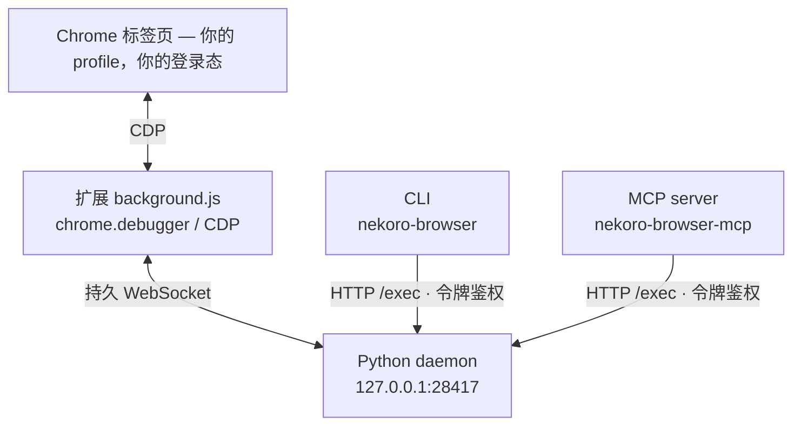

<p align="center">
  
</p>

<p align="center">
  <a href="https://github.com/zeshuochen/nekoro-browser/actions/workflows/tests.yml"></a>
  <a href="https://pypi.org/project/nekoro-browser/"></a>
  <a href="https://www.python.org/downloads/"></a>
  <a href="https://github.com/zeshuochen/nekoro-browser/blob/master/LICENSE"></a>
  <a href="#mcp任何-mcp-客户端"></a>
</p>

<p align="center">
让你的 AI 编程工具直接开你<b>自己的 Chrome</b> —— 打开网页、点击、把内容读回来，登录态照旧。
</p>

<p align="center">
  <a href="https://github.com/zeshuochen/nekoro-browser/blob/master/README.md"></a>
</p>

<p align="center">
  <a href="#快速开始">快速开始</a> ·
  <a href="#示例">示例</a> ·
  <a href="#横向对比">横向对比</a> ·
  <a href="#mcp任何-mcp-客户端">MCP</a> ·
  <a href="#api">API</a> ·
  <a href="#架构">架构</a> ·
  <a href="#自愈与站点知识">站点知识</a> ·
  <a href="#已知限制">已知限制</a> ·
  <a href="#参考手册">参考手册</a>
</p>

---

**nekoro-browser 驱动你日常用的那个 Chrome——登录态、cookie、会话，原样保留。**

别的自动化工具开的是*全新*浏览器：没有登录态，什么都干不了。nekoro-browser
只是加一个小扩展：同一个 profile，不另开实例，也不会弹「正受到自动测试软件控制」横幅。

> [!NOTE]
> 安装就一句 `uv tool install`——纯 Python 标准库，不捆绑浏览器引擎，不下 200MB。

每个 helper 自动反射成 MCP 工具（53 个），Claude Code、Cursor、Cline、opencode、Codex、
VS Code/Copilot 直接就能开浏览器。模型随便换，无订阅、无厂商锁定。MIT，扩展源码在仓库里。

## 快速开始

<details>
<summary><b>懒得自己装？</b>把这段整个粘给 Claude Code / Cursor / opencode</summary>

```
帮我装 nekoro-browser：
1. `uv tool install nekoro-browser`（没有 uv 就 `pipx install nekoro-browser`）。
2. 跑 `nekoro-browser setup`，把它打印的扩展目录给我看。这一步归我：我去
   chrome://extensions 打开开发者模式、点「加载已解压的扩展程序」、粘贴那个目录。
   等我说装好了再继续——这一步你替我点不了。
3. 然后另开一个终端启动 daemon 并保持不关：`nekoro-browser`。
4. 最后一步看我怎么用，先问我：
   - 在 AI 编辑器里用 → 注册 MCP server（`claude mcp add nekoro-browser --
     nekoro-browser-mcp`，或我这个客户端对应的配置），然后我重启客户端；
   - 只在终端用 → 不用配，`echo "page_info()" | nekoro-browser` 直接能跑。
5. 收尾跑 `nekoro-browser --doctor`，告诉我 daemon / 扩展 / service worker 是不是全绿。
```

</details>

**1 — 安装**（Python 3.12+，零第三方依赖）

```bash
uv tool install nekoro-browser
```

没装 [uv](https://docs.astral.sh/uv/) 的话 `pipx install nekoro-browser` 等效。

<sub>从源码装：<code>git clone https://github.com/zeshuochen/nekoro-browser && cd nekoro-browser && uv pip install -e .</code></sub>

> [!WARNING]
> **升级之后记得重载扩展。** `uv tool upgrade nekoro-browser` 只更新 Python 侧——
> 之后手动重载扩展：`nekoro-browser --reload-ext`（或 `chrome://extensions` 卡片上点**重新加载**）。

**2 — 加载扩展**

```bash
nekoro-browser setup
```

复制扩展目录到剪贴板并等待连接。期间：`chrome://extensions/` → 开**开发者模式** →
「**加载已解压的扩展程序**」→ 粘贴目录。

**3 — 启动 daemon** —— 另开**第二个终端**，**别关**（daemon 就是握着 Chrome 连接的后台
进程，关掉整条链就停）

```bash
nekoro-browser
```

**4 — 驱动浏览器。** 挑你实际的用法：

*从 AI 编程工具用（MCP）* —— Claude Code 一行搞定，其他客户端见 [MCP](#mcp任何-mcp-客户端)：

```bash
claude mcp add nekoro-browser -- nekoro-browser-mcp
```

重启客户端，直接让它开网页就行 —— 53 个浏览器工具会出现在工具列表里。

*从终端用* —— 把代码片段管道给正在跑的 daemon：

```bash
echo "page_info()" | nekoro-browser
# → {"ok": true, "result": {"title": "...", "url": "..."}}
```

哪一环挂了？`nekoro-browser --doctor` 分别检查 daemon / 扩展 / service worker 并指出。

---

## 示例

多步流程一次发过去。所有 helper 直接顶层 `await`，不用写 `asyncio`、不用 import：

```bash
nekoro-browser <<'PY'
await new_tab("https://example.com")
print((await page_info())["title"])            # Example Domain
print((await get_markdown(max_chars=200))["result"])
print((await state(max_items=3))["result"])    # 带 index/box 的可交互元素，喂给模型
await close_tab()
PY
```

<details>
<summary>Windows？<code>&lt;&lt;'PY'</code> 是 bash 专用，PowerShell 这样写</summary>

```powershell
@'
await new_tab("https://example.com")
print((await page_info())["title"])
'@ | nekoro-browser
```

结尾的 `'@` 必须顶格单独一行。只跑一句：
`nekoro-browser -c "await navigate('https://example.com')"`。

别用 `cmd.exe`——它的 `echo` 不脱引号，代码会以字符串送达，返回
`{"ok": true, "result": "page_info()"}` 而浏览器根本没被碰过。

</details>

`state()` 给元素编号，`click_index(n)` 按编号点——模型不用猜 CSS 选择器：

```bash
nekoro-browser <<'PY'
await navigate("https://github.com/search?q=browser+automation&type=repositories")
await wait_for_load()
print((await state(max_items=40))["result"])   # 每个可交互元素都带 index
PY
```

看清编号之后再点它 —— **编号随页面内容而变，别照抄某个固定数字**：

```bash
nekoro-browser -c "await click_index(7)"
```

全部 helper 见 [SKILL.md](https://github.com/zeshuochen/nekoro-browser/blob/master/SKILL.md)。

---

## 横向对比

| | CDP WebSocket | playwright-cli | opencli | **nekoro-browser** |
|------|:--:|:--:|:--:|:--:|
| 原理 | `--remote-debugging-port` | Playwright 扩展 | OpenCLI 扩展 | 自建扩展 + 持久 WebSocket |
| 安装 | 一行参数 | `npm i -g`（~200MB） | npm / 桌面应用 | `uv tool install`（纯标准库，零依赖） |
| 登录态 | ❌ 独立实例 | ✅ | ✅ | ✅ |
| 可修改扩展 | — | 需改 Playwright 源码 | 需改 OpenCLI 源码 | ✅ 扩展就在仓库里 |
| 自愈 | ❌ | ❌ | ❌ | ✅ Agent 运行时编辑 helpers |
| MCP | ❌ | ✅（另装 `@playwright/mcp`） | ❌ | ✅ 内置 53 个工具，`nekoro-browser-mcp` |
| 站点知识 | ❌ | ❌ | ❌ | ✅ 你写的笔记和脚本**在导航时主动送到 agent 手里** |

<sub>第三行为什么是 ❌：Chrome 136 起 <code>--remote-debugging-port</code> 不再接受默认 profile，裸 CDP 只能连一个没有你登录态的干净实例；扩展的 <code>chrome.debugger</code> 不受此限。</sub>

---

## MCP（任何 MCP 客户端）

MCP 是 Claude Code、Cursor 这类工具调用外部能力的协议。配好一次后，
模型直接拿到 `navigate`、`click_index`、`get_markdown` 这些一等公民工具。

**前提**：daemon 跑着（`nekoro-browser`，单独一个终端）——MCP server 只是转发层，
真正握着 Chrome 连接的是 daemon。

要注册的命令始终是 `nekoro-browser-mcp`，**不同的只是配置格式**：

**Claude Code**

```bash
claude mcp add nekoro-browser -- nekoro-browser-mcp
```

**Claude Desktop**（设置 → Developer → Edit Config）· **Cursor**（`~/.cursor/mcp.json`，
或 `.cursor/mcp.json` 只对单个项目）· **Cline**（MCP Servers → Configure MCP Servers）

```json
{ "mcpServers": { "nekoro-browser": { "command": "nekoro-browser-mcp" } } }
```

<sub>Claude Desktop 配置文件：macOS <code>~/Library/Application Support/Claude/claude_desktop_config.json</code> · Windows <code>%APPDATA%\Claude\claude_desktop_config.json</code></sub>

**opencode**（`opencode.json`）—— 注意键叫 `mcp`，且 `command` 是**数组**

```json
{ "mcp": { "nekoro-browser": { "type": "local", "command": ["nekoro-browser-mcp"], "enabled": true } } }
```

**Codex**（`~/.codex/config.toml`，或 `codex mcp add nekoro-browser -- nekoro-browser-mcp`）

```toml
[mcp_servers.nekoro-browser]
command = "nekoro-browser-mcp"
```

**VS Code / Copilot**（`.vscode/mcp.json`，或命令面板 `MCP: Open User Configuration`）
—— 键是 `servers`，不是 `mcpServers`

```json
{ "servers": { "nekoro-browser": { "command": "nekoro-browser-mcp" } } }
```

不想预先安装？把命令换成 `uvx` 即可按需拉起，相当于 `npx -y`：
`"command": "uvx", "args": ["--from", "nekoro-browser", "nekoro-browser-mcp"]`。
但它只免掉「装 MCP server」这一步，daemon 仍然要装、要跑着。

配完重启客户端。工具没出现的话，先跑 `nekoro-browser --doctor`
（daemon 死了和配错了表现一模一样），再看客户端的 MCP 日志
（Claude Desktop 在 macOS 是 `~/Library/Logs/Claude`，Windows 是 `%APPDATA%\Claude\logs`）。

除了工具清单：

- 两个逃生口 —— `cdp`（原始 CDP 命令）、`exec_python`（daemon 命名空间里跑任意 Python，
  多步流程一次往返）。
- 截图以 image content 返回，客户端直接渲染。
- helper 自己报的失败（`{"ok": false}`）标成 `isError`，不伪装成成功。
- 导航到你写过笔记/脚本的站点时，它们**跟着工具结果一起送过来** ——
  见[自愈与站点知识](#自愈与站点知识)。

## API

| 分类 | 命令 |
|------|------|
| 导航 | `navigate(url)`、`new_tab(url)`、`ensure_tab(url)`、`new_tab(url, reuse=True)`、`list_tabs()`、`switch_tab(id)`、`close_tab(id)`、`close_tabs(ids)`、`sweep_tabs()` |
| 页面信息 | `page_info()`、`page_html()`、`page_text()`、`get_markdown()`、`state()`、`refs()`、`find_text(t)`、`iframe_target(url_substr)` |
| JavaScript | `js(code)`、`cdp(method, **p)`、`cdp_batch(*cmds)` |
| 交互 | `click(loc)`、`click(loc, tab=id)`、`click_selector(sel)`、`click_ref(ref)`、`click_index(n)`、`click_at_xy(x,y)`、`type_text(t)`、`fill_input(sel,t)`、`press_key(k)`、`upload_file(sel,path)` |
| 弹窗 | `dialog_off()`、`get_last_dialog()` |
| 等待 | `wait_for_load()`、`wait_selector(sel)`、`wait_for_network_idle()`、`sleep(s)` |
| 下载 | `wait_for_download()` |
| 截图 | `capture_screenshot()`、`capture_screenshot("jpeg", 90)` |

---

## 架构



<details>
<summary>同一张图的纯文本版（给不渲染 Mermaid 的地方，比如 PyPI）</summary>

```
Chrome 扩展 (background.js) —— chrome.debugger / CDP
        ↕ 持久 WebSocket
Python daemon (127.0.0.1:28417)
        ↕ HTTP /exec（令牌鉴权）
CLI (nekoro-browser)  ·  MCP server (nekoro-browser-mcp)
```

</details>

- `helpers.py` —— 54 个 helpers（53 个暴露成 MCP 工具），都不认识任何具体网站。
- `lifecycle.py` —— pid 文件 + 进程指纹防误杀、僵尸自愈（CDP 探活失败自动清理重启）、
  localhost 绕过系统代理。
- 扩展侧针对 MV3 service worker 回收做了硬化 —— `content_scripts` 心跳（页面里的独立
  唤醒向量，SW 被杀也能重连）+ `onStartup`（Chrome 冷启动即连）+ 断线后重挂上次操作
  的标签，不漂到空白页。

## 自愈与站点知识

Agent 遇到缺口时当场补、当场用——不重新编译，不重启 daemon，不重载扩展。

- `src/nekoro_browser/agent_helpers.py` 是**草稿纸**：每次 `/exec` 自动 reload，适合临时试。
  它在已安装的包里面，升级会被覆盖。
- 想长期留着的放你自己的 skills 目录（`NEKORO_DOMAIN_SKILLS`，回落到仓库内
  `domain-skills/`），一个站点一个目录，两种材料放一起：`<site>/*.md` 记知识，
  `<site>/*.py` 放流程。脚本每次调用都会载入 `/exec` 命名空间，并且能直接用内置 helper。

关键在于这些材料**会主动找上 agent，而不是等着被发现**。站点有材料时，
`navigate()` / `new_tab()` 的返回值里会多两个字段：

```python
{'ok': True, 'loaded': True,
 'notes':   ['example/search.md — Example — 搜索结果页'],
 'actions': ['open_first_result(query) — 搜索并打开第一条结果']}
```

`notes` 只给标题；`actions` 列的是已经能直接调的函数，agent 调它就行，不必重拼流程。
`list_site_actions()` 可查全部已载入的函数，含载入失败的文件。什么该记、什么不该记，
见 [`domain-skills/README.md`](https://github.com/zeshuochen/nekoro-browser/blob/master/domain-skills/README.md)。

标签同理：上次留下的标签登录态和页面状态都还在，所以托管组里已有同站标签时，
`new_tab()` 会多带一个 `existing`：

```python
{'ok': True, 'tabId': 42, 'loaded': True,
 'existing': {'hint': '同站已有标签；switch_tab(id) 可复用，或 new_tab(url, reuse=True)',
              'tabs': [{'tabId': 17, 'title': 'Example Domain'}]}}
```

标签照开，这个字段只是让「有得复用」出现在即将造出重复标签的那一刻；要直接复用传
`reuse=True`。**不会自动关掉任何标签**：`sweep_tabs()` 只*报告*候选（同站重复、游离
`about:blank`），`sweep_tabs(dry_run=False)` / `close_tabs([...])` 才真关，活动标签永远
不进候选。

---

## 平台支持

| 平台 | 状态 |
|------|------|
| Windows | 主力开发平台，全链路实测 |
| Linux / macOS | 有平台分支 + CI，**完整 Chrome 链路未实测** —— 欢迎反馈 |

<sub>Linux/macOS 有对应分支（`~/.config` 与 `~/Library/Application Support` 数据目录、
`chmod 600` 令牌、`/proc` 与 `ps` 存活探测），单测在 CI 上跑三平台；但「Chrome + 扩展」
的完整链路从未在真机 macOS/Linux 上跑过。</sub>

## 已知限制

- **未打包的扩展会被 Chrome 停用。** 以「加载已解压的扩展程序」装的扩展，在 Chrome 更新或重启后可能被自动关掉、或弹出「停用开发者模式扩展程序」的提示。`--doctor` 报 Extension/SW 不响应时，先去 `chrome://extensions/` 把它重新打开。本项目目前**不发 Chrome 应用商店**，这条限制短期内不会消失。
- **Service Worker 保活不是 100%。** MV3 的回收时机由 Chrome 决定。心跳 + `onStartup` + 自动重挂能覆盖绝大多数情况，但无人值守的长时 cron 任务仍建议先 `--doctor` 健康检查再重试。
- **一切围绕一个「活动标签」。** 16 个 helper（`click`、`click_selector`、`state`、`wait_selector`、`fill_input` 等）可以传 `tab=id` 指定另一张**已 attach** 的标签——指名了却没 attach 会直接报错，**不会悄悄退回活动标签**。其余 37 个恒跟随活动标签。仍然不做并行会话：一个 daemon 驱动一个 Chrome，请求串行。
- **下载落在 Chrome 自己设定的目录，路径改不了。** `wait_for_download()` 返回 `{url, filename, bytes}`——只有文件名，没有完整路径。要改目录请在 Chrome 设置里改。<sub>`Browser.setDownloadBehavior`（`-32601`）和已废弃的 `Page.setDownloadBehavior`（`-32000 "Cannot not access browser-level commands"`）都是 browser-level 命令，`chrome.debugger` 只拿得到 tab target，一律被拒。</sub>
- **MCP server 串行处理请求。** 一次 `wait_selector(timeout=90)` 期间，同一连接上的其他请求（含 `ping`）会排队等它做完。要并发就开多个客户端连接。

---

## 参考手册

<details>
<summary><b>CLI 参数、配置、故障排查、安全</b> —— 点开展开</summary>

### CLI

| 命令 | 作用 |
|------|------|
| `nekoro-browser` | 前台启动 daemon |
| `nekoro-browser setup` | 引导式安装：复制扩展路径，然后一直等到扩展真的连上 |
| `nekoro-browser --ensure` | 自愈式就绪检查：Chrome 没开就拉起、daemon 没跑就后台起、扩展没响应就重载 SW。全绿才退 0——跑任务前用这条，别再手动重演那几步。端口已被占着但不应答时它**不会**再起一个，只报出 pid 交给你处置 |
| `nekoro-browser --doctor` | 端到端诊断（daemon + 扩展 + SW 是否都活着）——只报不修 |
| `nekoro-browser --stop` | 停止 daemon |
| `nekoro-browser --restart` | 停止后重启（前台） |
| `nekoro-browser --reload-ext` | 命扩展重载 service worker，**升级后必须跑一次**；跑批量任务前刷干净状态也用它 |
| `nekoro-browser --extension-path` | 打印扩展目录（加载已解压扩展时用） |
| `nekoro-browser --version` | 打印已安装版本（和你加载的扩展对一下） |
| `nekoro-browser --port N` | daemon 监听 N 端口（默认 28417） |
| `nekoro-browser --allow-domains LIST` | daemon 只允许操作这些域，逗号分隔（如 `jd.com,*.taobao.com`）。不传则不限制；也可用 `NEKORO_ALLOW_DOMAINS` 环境变量 |
| `nekoro-browser -c "code"` | 执行一段代码并返回结果 |
| `nekoro-browser --timeout N` | 单次执行的超时秒数（默认 120，等页面加载很费时） |
| `echo "code" \| nekoro-browser` | 管道模式（需 daemon 已运行） |

### 配置

daemon 默认监听 **28417**。要改：

| 哪一侧 | 怎么改 |
|--------|--------|
| Python（daemon / CLI / MCP） | `nekoro-browser --port 30500`，或设环境变量 `NEKORO_PORT=30500` |
| 扩展 | 扩展详情页 → **扩展程序选项** → 填端口 → Save（立即重连，不用重载扩展） |

两侧必须一致。客户端不用重复传参：daemon 会把实际端口写进 `<数据目录>/port`，
所以直接 `echo ... | nekoro-browser` 也能找到跑在非默认端口上的 daemon。
优先级 `--port` > `NEKORO_PORT` > 该文件 > 默认值。

存放令牌 / pid / port 的数据目录：Windows `%LOCALAPPDATA%\nekoro-browser`、
macOS `~/Library/Application Support/nekoro-browser`、其余 POSIX
`$XDG_CONFIG_HOME/nekoro-browser` 或 `~/.config/nekoro-browser`。
`NEKORO_DATA_DIR` 可在任意平台覆盖 —— 覆盖的是**上面那串路径的父目录**，程序仍会在其下建一层 `nekoro-browser/`。即 `NEKORO_DATA_DIR=/my/dir` 时 token 落在 `/my/dir/nekoro-browser/token`，不是 `/my/dir/token`。

### 故障排查

| 现象 | 原因 | 解决 |
|------|------|------|
| `Daemon not running` | daemon 没启动 | 终端 1 运行 `nekoro-browser` |
| CDP 命令超时 | 扩展未连接 / service worker 睡死 | `nekoro-browser --doctor` 定位；必要时 `--reload-ext` 或 `chrome://extensions` 手动重载 |
| 扩展被 Chrome 停用 | 未打包扩展 + Chrome 更新 | `chrome://extensions/` 重新启用，再 `--doctor` 复验 |
| 页面没变化 | 扩展未 attach | 打开普通网页（非 chrome://），重启 daemon |
| 端口占用 | 旧进程残留 | 杀掉占用 28417 的进程，或直接 `nekoro-browser --stop` |
| `chrome://extensions` 上扩展卡片出现红色**错误** | daemon 没跑，扩展在反复重连 | **不是扩展坏了。** 起 daemon（`nekoro-browser`）后不再新增，卡片上点「清除全部」清掉旧的 |

<sub>最后一条几乎人人都会碰到：装完扩展、还没来得及起 daemon，那段时间每次重连都会记一条
<code>WebSocket connection to 'ws://127.0.0.1:28417/ws' failed: ERR_CONNECTION_REFUSED</code>。
这条消息由 Chrome 网络栈发出，在 JS 层之下 —— 扩展里的 <code>try/catch</code> 和
<code>ws.onerror</code> 都抑制不了它，改用 <code>fetch</code> 先探活也一样。所以它只能被解释，不能被消掉。</sub>

### 安全

daemon 监听 `127.0.0.1`，`/exec` 会执行任意 Python，故传输层加了守卫：

- **CLI / MCP → daemon**（`/exec`、`/raw`）：每会话签发令牌，写入用户私有文件——Windows 是 `%LOCALAPPDATA%\nekoro-browser\token`，macOS 是 `~/Library/Application Support/nekoro-browser/token`，其余 POSIX 是 `$XDG_CONFIG_HOME` 或 `~/.config/nekoro-browser/token`，POSIX 上 `chmod 600`。客户端读取后带在 `X-Nekoro-Token` 头里；缺失/错误 → `403`。网页和远程主机读不到本地文件，拿不到令牌。`/ping` 免令牌。
- **扩展 → daemon**（`/ws`）：握手 `Origin` 必须是 `chrome-extension://…`；网页对 localhost 发起的 `WebSocket` 带自己的域名 Origin，会被拒。

同用户的本地进程能读令牌文件——这条边界等于操作系统账户，与 browser-harness 的 `chmod 600` 一致。

</details>

---

## 反馈

用着有问题、或者想要的 helper 没有，开个 [issue](https://github.com/zeshuochen/nekoro-browser/issues)。
提 bug 时带上 `nekoro-browser --doctor` 的输出、Chrome 版本和操作系统，能省一轮来回。

PR 欢迎。改动前先跑一遍测试：`for f in tests/test_*.py; do uv run python "$f"; done`（三平台 CI 也会跑）。

---

## 致谢

架构核心来源于以下项目：

- **[browser-harness](https://github.com/browser-use/browser-harness)** — helpers.py 的薄封装哲学（每个函数是 CDP 命令的别名，≤10 行）、管道模式、自愈 `agent_helpers.py`、domain-skills 目录结构、`cdp()` 原始访问接口
- **[browser-act](https://github.com/browser-act/skills)** — `state()` 索引元素树、`*[N]` 增量标记、`waitSelector()` 状态等待、`getMarkdown()` 页面提取
- **[Playwright](https://github.com/microsoft/playwright)** — CDP `Input.dispatchMouseEvent` 真实鼠标事件（`isTrusted:true`）、扩展+daemon 双路径架构

思路借鉴：

- **[ego-lite](https://github.com/citrolabs/ego-lite)** — "code base，不是 CLI base"（agent 写脚本而不是命令循环）、统一 locator 语法（`css:` / `text:` / `xpath=` …）配 `transient`/`permanent` 元素解析错误分类（重试/放弃的决策信号，→ `click()`）、"名字即语义"的 `openOrReuseTab`（→ `ensure_tab()`）、把经验积累当作一等设计目标（nekoro 的 domain-skills 正是在做这件事）
