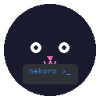

<p align="center">
  
</p>

<h1 align="center">nekoro-browser</h1>

<p align="center">
  <a href="https://www.python.org/downloads/"></a>
  <a href="LICENSE"></a>
  <a href="https://github.com/zeshuochen/nekoro-browser"></a>
</p>

<p align="center">
Lightweight browser automation CLI. Control your daily Chrome via extension — <b>keep cookies</b>, <b>zero ports</b>, <b>no banners</b>.<br>
<sub><a href="README.md">中文</a></sub>
</p>

---

## Why Not CDP WebSocket?

Chrome 136+ disables `--remote-debugging-port` for default profiles. nekoro-browser uses a custom extension + a persistent WebSocket to the daemon instead.

| | CDP WebSocket | playwright-cli | opencli | **nekoro-browser** |
|------|:--:|:--:|:--:|:--:|
| Approach | `--remote-debugging-port` | Playwright extension | OpenCLI extension | Custom extension + persistent WebSocket |
| Install | one flag | `npm i -g` (~200MB) | npm / desktop app | `pip install` (stdlib only) |
| Login state | ❌ fresh instance | ✅ | ✅ | ✅ |
| Modify extension | — | Edit Playwright source | Edit OpenCLI source | ✅ right in this repo |
| Self-healing | ❌ | ❌ | ❌ | ✅ Agent edits helpers.py at runtime |
| Scriptable flows | ❌ | ❌ | ❌ | ✅ Compose flows as helpers, one command |

## Install

```powershell
git clone https://github.com/zeshuochen/nekoro-browser
cd nekoro-browser
pip install -e .       # registers the `nekoro-browser` command
```

Load the Chrome extension:
1. Open `chrome://extensions/`, enable "Developer mode"
2. "Load unpacked" → select the `extension/` directory
3. Verify no errors

## Quick Start

> ⚠️ **Load the extension first, then start the daemon.** Wrong order = 60s timeout.

**Terminal 1** — start the daemon (keep it running):

```bash
nekoro-browser
```

**Terminal 2** — verify it works:

```bash
echo "page_info()" | nekoro-browser
# → {"ok": true, "result": {"title": "...", "url": "..."}}
```

## Example: Douyin Search & Like (one command)

```bash
echo "douyin_like('some+creator')" | nekoro-browser
```

Douyin keyboard shortcuts: `z`=like `x`=comment `c`=collect `G`=follow

## Architecture

`helpers.py` (30+ thin wrappers) → CDP commands, each ≤10 lines. Thick logic lives in `domain-skills/`.

## API

All 30+ helpers documented in [SKILL.md](SKILL.md). Common ones:

| Category | Commands |
|----------|----------|
| Navigation | `navigate(url)`, `new_tab(url)`, `list_tabs()`, `switch_tab(id)` |
| Page info | `page_info()`, `page_html()`, `page_text()` |
| JavaScript | `js(code)`, `cdp(method, **p)`, `cdp_batch(*cmds)` |
| Interaction | `click_selector(sel)`, `click_at_xy(x,y)`, `type_text(t)`, `fill_input(sel,t)`, `press_key(k)` |
| Waiting | `wait_for_load()`, `wait_selector(sel)`, `sleep(s)` |
| Screenshots | `capture_screenshot()`, `capture_screenshot("jpeg", 90)` |

## Self-Healing

Edit `helpers.py` at runtime. Agent adds missing functions on failure — takes effect on next call, no restart needed.

## Troubleshooting

| Symptom | Cause | Fix |
|---------|-------|-----|
| `Daemon not running` | Daemon not started | Run `nekoro-browser` in terminal 1 |
| CDP timeout | Extension not connected | Check `chrome://extensions` for errors |
| Page unchanged | Extension not attached to tab | Open a regular (non-chrome://) page, restart daemon |
| Port in use | Stale process | Kill the process on port 9230 |

## Security

The daemon listens on `127.0.0.1` and `/exec` runs arbitrary Python, so the transport is guarded:

- **CLI → daemon** (`/exec`, `/raw`): a per-session token is written to a user-private file (`%LOCALAPPDATA%\nekoro-browser\token`, `chmod 600` on POSIX). The CLI reads it and sends `X-Nekoro-Token`; missing/wrong token → `403`. Web pages and remote hosts can't read local files, so they can't obtain it. `/ping` stays open.
- **Extension → daemon** (`/ws`): the handshake `Origin` must be `chrome-extension://…`; a web page's `WebSocket` to localhost carries its own origin and is rejected.

Same-user local processes can read the token file — that boundary matches the OS user account, as with browser-harness's `chmod 600`.

---

## Acknowledgments

Core architecture derived from:

- **[browser-harness](https://github.com/browser-use/browser-harness)** — thin-wrapper philosophy (each function is a CDP alias, ≤10 lines), pipe mode, self-healing `agent_helpers.py`, domain-skills directory structure, `cdp()` raw access
- **[browser-act](https://github.com/browser-act/skills)** — `state()` indexed element tree, `*[N]` change markers, `waitSelector()` state polling, `getMarkdown()` page extraction
- **[Playwright](https://github.com/microsoft/playwright)** — CDP `Input.dispatchMouseEvent` real mouse events (`isTrusted:true`), extension + daemon dual-path architecture
